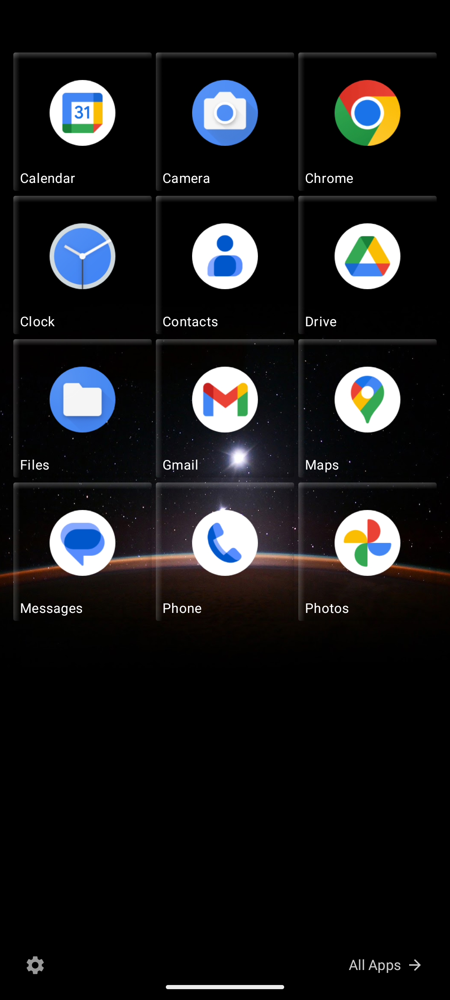
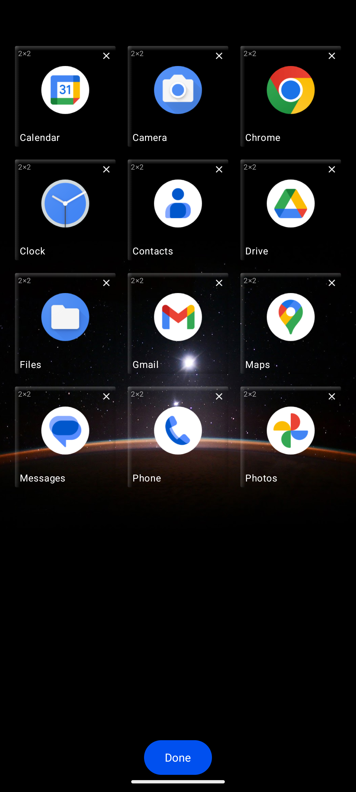
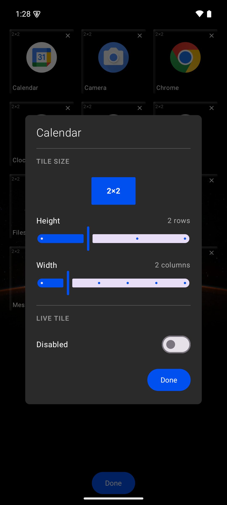
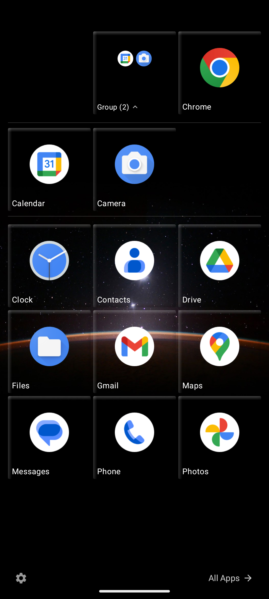
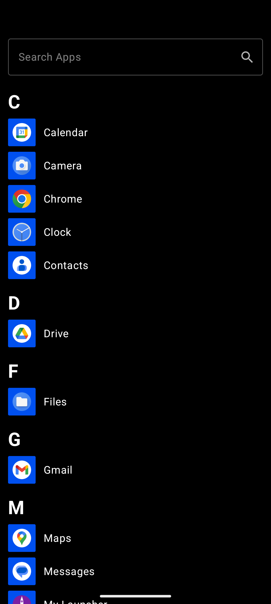
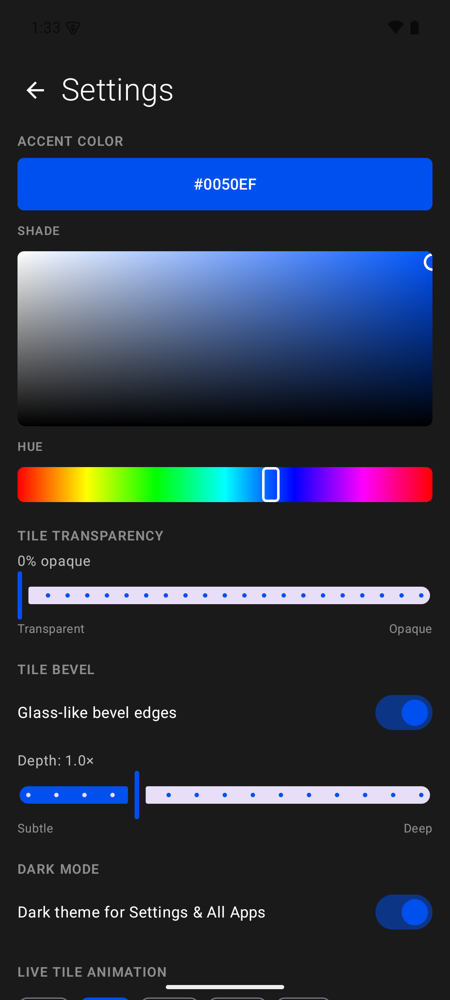

# My Launcher User Guide

**Version:** 0.1.0-alpha  
**Platform:** Android 10+ (API 29)

---

## Table of Contents

| | |
|---|---|
| 1. [Overview](#overview) | 6. [App List](#app-list) |
| 2. [Getting Started](#getting-started) | 7. [Settings](#settings) |
| 3. [Start Screen](#start-screen) | 8. [Tips & Tricks](#tips--tricks) |
| 4. [Tiles](#tiles) | 9. [Troubleshooting](#troubleshooting) |
| 5. [Tile Groups](#tile-groups) | |

---

## Overview

My Launcher is an Android home-screen replacement that recreates the Windows Phone Metro UI on modern Android devices. It replaces the standard Android home screen with a vertically scrolling grid of resizable tiles that launch your apps. The design features bold typography, solid-color tiles with glass bevel effects, and your wallpaper visible behind transparent tiles.

---

## Getting Started

### First Launch

1. Install and open My Launcher.
2. When prompted, set My Launcher as your default home app (optional — you can also set it later in Android Settings → Default Apps → Home App).
3. The Start Screen appears with up to 12 tiles pre-populated from your installed apps, arranged in a 3×4 grid of 2×2 tiles.

### Navigation

- **Start Screen** — your main home screen with tiles. Scroll vertically to see all tiles.
- **App List** — swipe right from the Start Screen, or tap **"All Apps →"** at the bottom-right.
- **Settings** — tap the **gear icon** (⚙) at the bottom-left of the Start Screen while in edit mode, or from the bottom of the Start Screen.
- **Home button** — returns to the top of the Start Screen.
- **Notification shade** — swipe down from the top as usual.

---

## Start Screen

The Start Screen is a 6-column vertically scrolling tile grid. Tiles are placed at specific grid coordinates and can be any size from 1×1 to 6×4.

  

### Launching Apps

Tap any tile to launch its associated app.

### Edit Mode

**Long-press** any tile to enter edit mode. In edit mode:

- Tiles shrink slightly and display a **size label** (e.g., "2×2") in the top-left corner.
- An **Unpin button** (✕) appears on each tile — tap to remove a tile from the Start Screen.
- **Tap a tile** to open its **Tile Settings Dialog** (resize, toggle live tile).
- **Tap a group** to open the **Group Rename Dialog**.
- Tap **"Done"** at the bottom of the screen to exit edit mode.

  

### Moving Tiles (Drag & Drop)

1. Long-press a tile to start dragging (this also enters edit mode).
2. Drag the tile to a new position on the grid. A **white outline** shows where the tile will be placed.
3. Release to drop. Any tiles overlapping the new position are automatically displaced to the nearest available space.

[↑ Back to Table of Contents](#table-of-contents)

---

## Tiles

### Tile Sizes

Tiles can span 1–6 columns wide and 1–4 rows tall. Common sizes:

| Size | Columns × Rows | Description |
|------|-----------------|-------------|
| Small | 1×1 | Icon only, no label |
| Medium | 2×2 | Icon + app name (default) |
| Wide | 4×2 | Large icon + app name |
| Large | 6×4 | Full-width, maximum height |

**Constraint:** Tiles 4 or more columns wide must be at least 2 rows tall.

### Resizing Tiles

1. Enter edit mode (long-press any tile).
2. Tap the tile you want to resize.
3. In the **Tile Settings Dialog**, adjust the **Width** and **Height** sliders.
4. A live preview shows the new size. Tap outside or press back to confirm.

  

### Per-Tile Settings

Each tile supports:

- **Size** — adjustable via width/height sliders.
- **Live Tile toggle** — enables animated content cycling (currently a visual toggle; live content data sources are coming in a future update).
- **Color override** — per-tile accent color (available in the data model).
- **Opacity override** — per-tile transparency (available in the data model).

### Tile Visual Effects

- **Tilt animation** — tiles tilt 3° when pressed, giving a subtle 3D effect.
- **Bevel (glass effect)** — a gradient overlay that creates a glass-like appearance with highlights along the top-left and shadows along the bottom-right. Adjustable in Settings.

[↑ Back to Table of Contents](#table-of-contents)

---

## Tile Groups

### Creating a Group

1. Long-press a tile to start dragging.
2. Drag it **over another tile** and **hold still for ~1 second** (800ms).
3. Release — the two tiles merge into a group.

The key distinction: **quick drag-and-release moves** a tile; **dragging onto a tile and holding** creates a group. Natural hand tremor is tolerated — your finger can move slightly within a small radius while dwelling.

### Adding to an Existing Group

Drag a tile onto an existing group tile and hold for ~1 second, then release.

### Group Header

A group appears as a 2×2 tile showing:

- A 2×2 mini-grid of up to 4 app icons as a preview.
- The group name and member count (e.g., "Group (3)").
- An expand/collapse arrow.

### Expanding & Collapsing

Tap a group (when not in edit mode) to expand it. The group's member tiles appear in a sub-grid below the group header, separated by thin divider lines. Tap the group header again to collapse.

  

### Rearranging Tiles Within a Group

While a group is expanded, long-press a member tile to drag and rearrange within the group's sub-grid.

### Ungrouping a Tile

While a group is expanded, drag a member tile **outside the group area** to remove it from the group. It will be placed at the nearest available cell on the main grid.

If only one tile remains after removal, the group is automatically dissolved.

### Renaming a Group

1. Enter edit mode (long-press any tile).
2. Tap the group you want to rename.
3. Type a new name in the dialog and tap **Rename**.

[↑ Back to Table of Contents](#table-of-contents)

---

## App List

Swipe right from the Start Screen or tap **"All Apps →"** to access the App List.

  

### Features

- **Alphabetical grouping** — apps are organized under letter headers (A, B, C…).
- **Search** — type in the search bar at the top to filter apps in real time.
- **Launch** — tap any app to open it.
- **Pin to Start** — long-press any app to add it as a 2×2 tile on the Start Screen. A toast confirms the action.

[↑ Back to Table of Contents](#table-of-contents)

---

## Settings

Access Settings via the gear icon on the Start Screen.

  

### Accent Color

A full **HSV color picker** lets you choose any accent color:

- **2D gradient box** — select saturation (horizontal) and brightness (vertical).
- **Hue slider** — select the base hue along the color spectrum.
- A live **preview swatch** shows the selected color with its hex code.

The accent color is applied globally to all tile backgrounds and UI highlights.

### Tile Transparency

Slide from 0% (fully transparent — wallpaper shows through) to 100% (fully opaque). The system wallpaper is always rendered behind the Start Screen.

### Bevel (Glass Effect)

- **Toggle** — enable or disable the glass bevel effect on all tiles.
- **Depth slider** — adjust from Subtle (0.2×) to Deep (3.0×) to control the intensity of the gradient highlights and shadows.

### Dark Mode

Toggle dark or light theme for the Settings and App List screens. The Start Screen is always transparent regardless of this setting.

### Live Tile Animation Interval

Choose how frequently live tiles cycle their content:

| Option | Interval |
|--------|----------|
| 3s | Every 3 seconds |
| 5s | Every 5 seconds (default) |
| 10s | Every 10 seconds |
| 30s | Every 30 seconds |
| Off | Animations disabled |

### Saved Themes

- **Save Current Layout** — captures your current tile arrangement, accent color, opacity, and animation settings as a named theme.
- **Apply** — restore a saved theme's settings.
- **Delete** — remove a saved theme.

Each saved theme shows its name, tile count, creation date, and accent color swatch.

[↑ Back to Table of Contents](#table-of-contents)

---

## Tips & Tricks

- **Wallpaper transparency** — set tile opacity to a low value (10–30%) for a stunning translucent effect where your wallpaper shows through the tiles.
- **Mixed tile sizes** — combine Small (1×1), Medium (2×2), and Wide (4×2) tiles for a dynamic, information-rich layout.
- **Quick reorganize** — when you move or resize a tile, overlapping tiles are automatically pushed to the nearest free space. No manual cleanup needed.
- **Group related apps** — drag Calculator onto Clock to create a "Utilities" group, then rename it.

[↑ Back to Table of Contents](#table-of-contents)

---

## Troubleshooting

### Tiles overlap after resizing

This shouldn't happen — overlapping tiles are automatically displaced. If you notice an issue, try entering edit mode and slightly moving the overlapping tile.

### Can't create a group

Make sure you **hold still** over the target tile for about 1 second. If you release too quickly, the tile will be moved instead of grouped. A small amount of finger tremor is OK.

### App not appearing in App List

My Launcher shows all apps with a launcher intent. System apps without a launcher activity (e.g., system services) won't appear. Try pulling down to refresh or restarting the app.

### Wallpaper not visible behind tiles

Ensure **Tile Transparency** in Settings is set below 100%. At 100% opacity, tiles are fully opaque and the wallpaper won't show through.

### App crashes on launch

Clear app data: Android Settings → Apps → My Launcher → Storage → Clear Data. This resets all tiles and preferences to defaults.

[↑ Back to Table of Contents](#table-of-contents)

---

*For technical details, see the [README](../README.md). For the full feature roadmap, see the [PRD](My%20Launcher%20PRD.md).*
